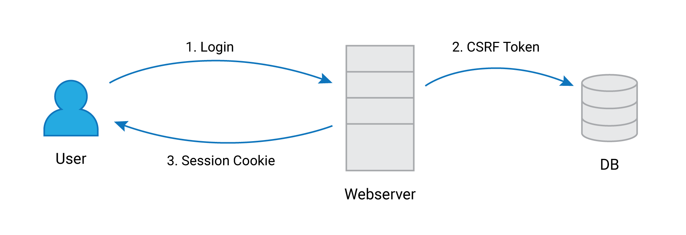
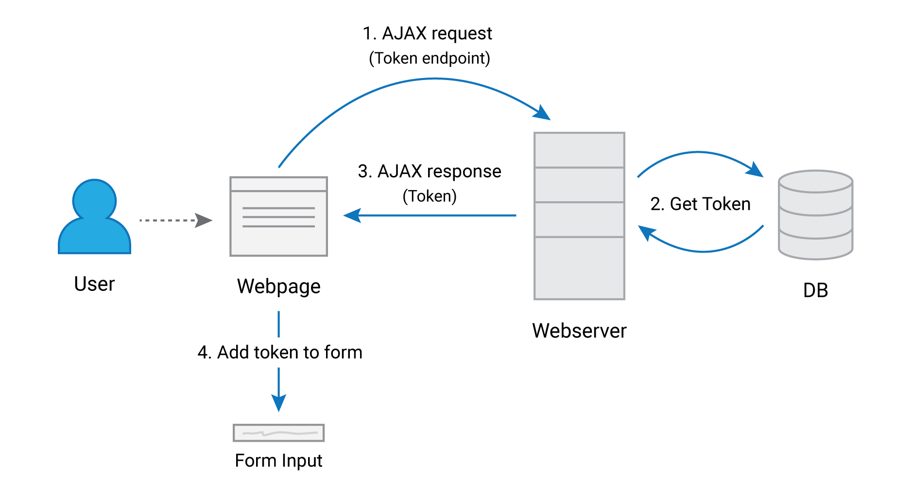
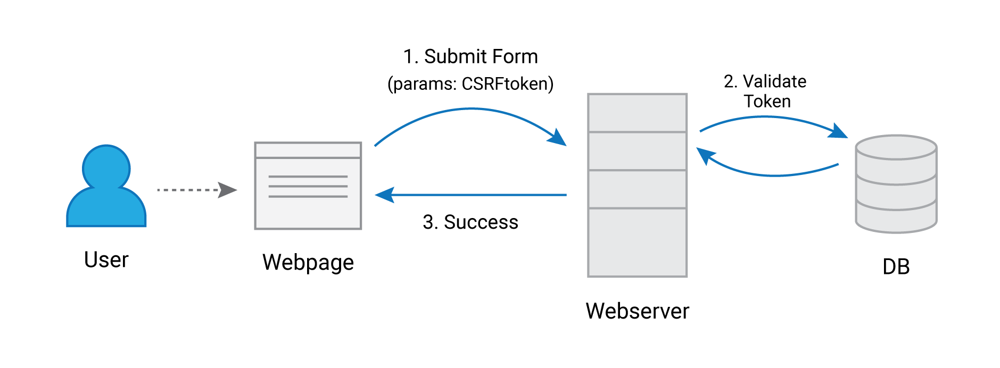

# Synchronizer Token Pattern

The **synchronizer token pattern** is a technique used prevent **cross-site request forgery (CSRF)** attacks. In this technique, a secret token is generated and embedded into forms for every request. The tokens are then validated server-side to authenticate the user.

The token is a random number generated at the moment when the user logs in. The token is stored server-side and is tied to the user's session ID.

When the users visits a form on the website, the page sends an AJAX request to and endpoint that responds with the CSRF token for the user based on the user's session data. This token is then added to the form as a hidden input.

When the user submits the form, the token is sent along with the other parameters. The sent token is again compared with the token stored at the server, and if they match, the server responds with a success message. Otherwise, an error message is shown and the request is not processed.

Now, if an attacker tries to send a request pretending to be the user, they will not have the user's session data or their CSRF value. So because of this, the attacker's request will not be processed by the server.

## Tasks
Implement a web application that matches following criteria.

- [x] User login. You may use hard coded user credentials for demonstration purpose.

- [x] Upon login, generate session identifier and set as a cookie in the browser.

- [x] At the same time, generate the CSRF token and store it in the server side. You may store it in-memory. The CSRF token is mapped to the session identifier.

- [x] In the website, implement an endpoint that accepts HTTP POST requests and respond with the CSRF token. The endpoint receives the session cookie and based on the session identifier, return the CSRF token value.

- [x] Implement a webpage that has a HTML form. The method should be POST and action should be another URL in the website. When this page loads, execute an Ajax call via a javascript, which invokes the endpoint for obtaining the CSRF token created for the session.

- [x] Once the page is loaded, modify the HTML form’s document object model (DOM) and add a new hidden field that has the value of the received CSRF token.

- [x] Once the HTML form is submitted to the action, in the server side, extract the received CSRF token value and check if it is the correct token issued for the particular session. You this, you need to obtain the session cookie and get the corresponding CSRF token for the session and compare that with the received token value.

- [x] If the received CSRF token is valid, show success message. If not show error message.
